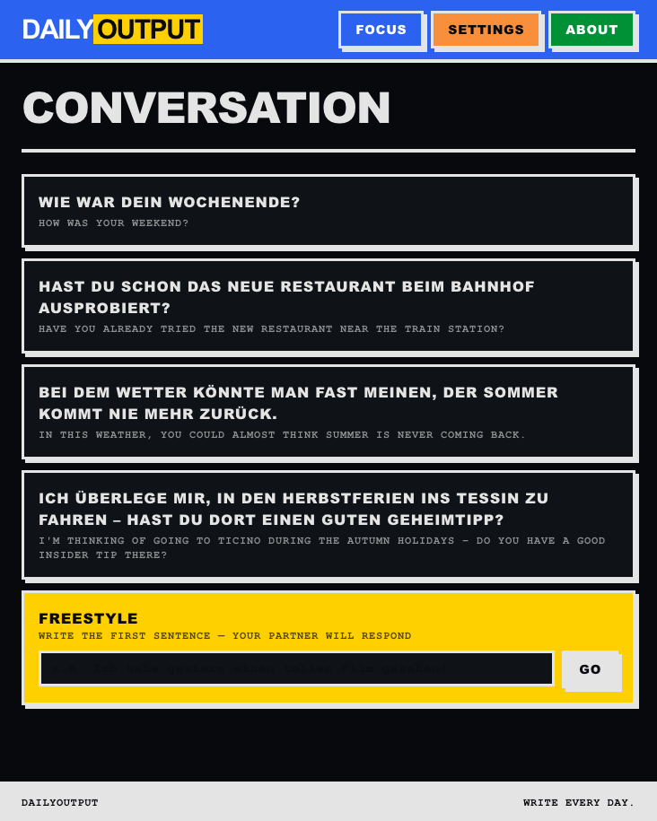
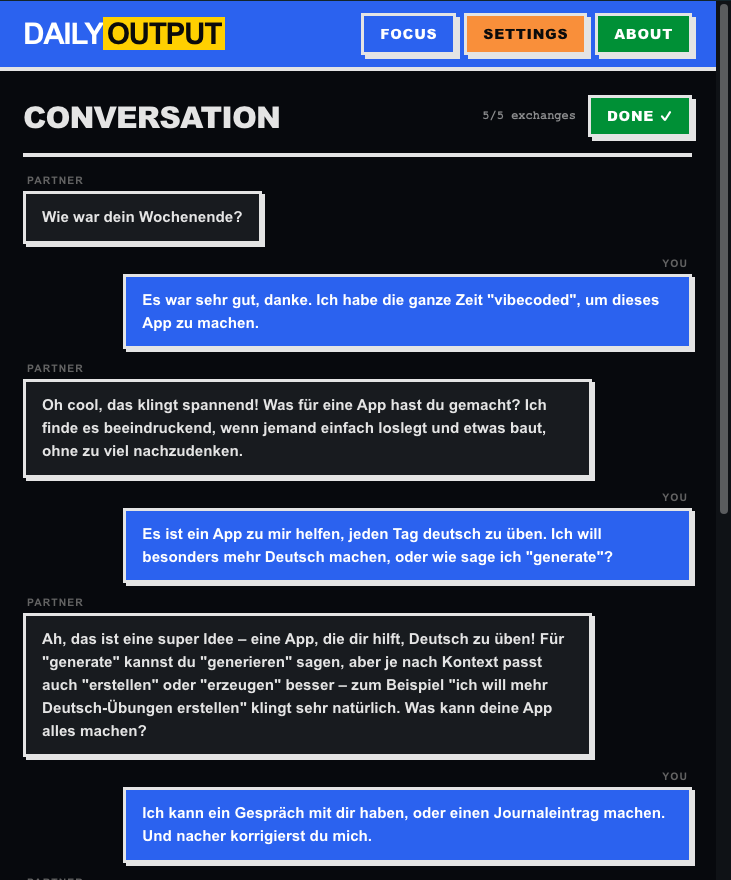
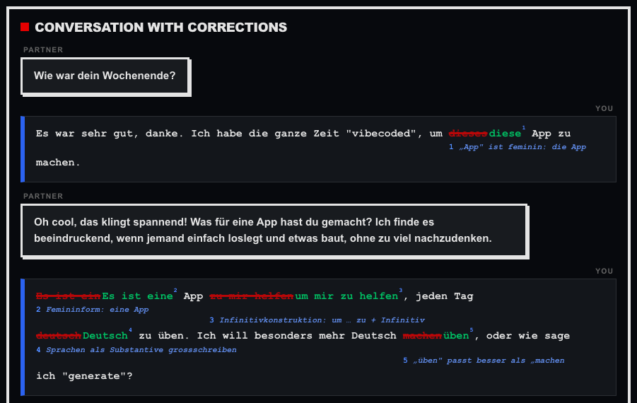
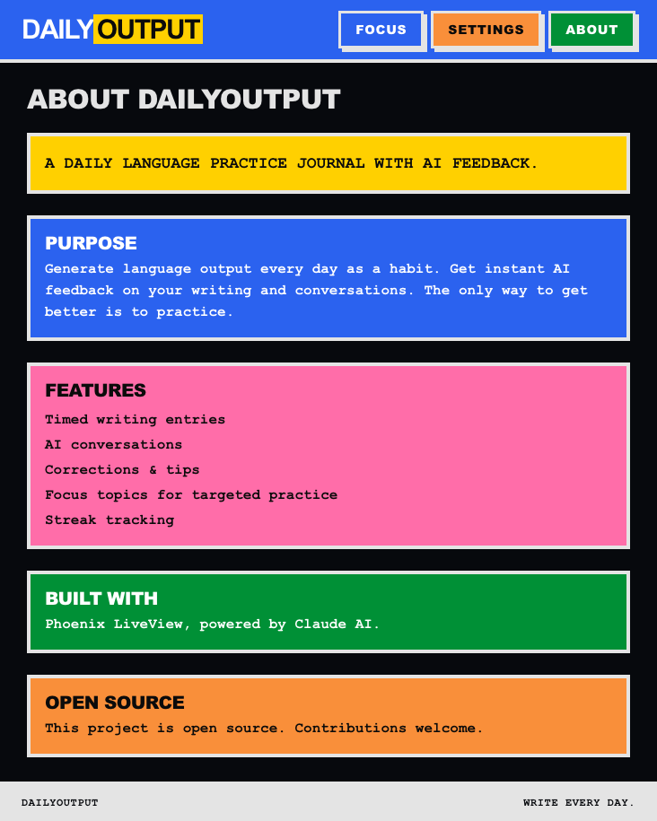

# DailyOutput

A daily language practice journal with AI feedback. Write and speak in your target language every day, get instant inline corrections and learning tips.

Built with Phoenix LiveView, SQLite, and the Anthropic API (Claude). Brutalist UI design.

## Why

The only way to improve at a language is to produce output — writing and speaking — regularly. DailyOutput gives you a daily structure: write a timed journal entry, have an AI conversation, get detailed feedback, and track your streak. The AI adapts to your CEFR level so you only see corrections relevant to what you should know.

## Features

- **Timed writing entries** — AI-generated prompts, configurable timer, distraction-free editor
- **AI conversations** — Role-play with a language partner who responds naturally
- **Inline corrections** — College professor style: strikethrough + corrections with annotations
- **Tips & commentary** — Grammar patterns, suggestions, encouragement
- **Focus topics** — Save tips from feedback, choose one to practice before each session
- **Streak tracking** — Daily challenge (1 entry + 1 conversation), streak counter
- **Versioning** — Edit entries, continue conversations, track all versions
- **PWA** — Install on your phone, works offline
- **i18n** — English and German UI, auto-switches based on your level (B1+ = target language)

## Screenshots

| | |
|---|---|
|  |  |
|  |  |

## Supported Languages

The app works with any target language for AI feedback. The UI itself is available in:
- English (default)
- German

The AI prompts for German use Swiss Standard German conventions (no ß).

## Setup

### Prerequisites

- Elixir 1.15+
- Node.js (for JS tests)
- An [Anthropic API key](https://console.anthropic.com/)

### Development

```bash
# Install dependencies
mix setup

# Create .env with your API key
cp .env.example .env
# Edit .env with your ANTHROPIC_API_KEY

# Start the server
mix phx.server
```

Visit [localhost:4000](http://localhost:4000).

### Docker

```bash
cp .env.example .env
# Edit with ANTHROPIC_API_KEY and SECRET_KEY_BASE (generate: mix phx.gen.secret)

docker compose up -d
```

### Container Publishing (GHCR)

This repository includes a GitHub Actions workflow at
`.github/workflows/publish-container.yml` that builds and publishes the container
image to GitHub Container Registry (`ghcr.io`).

- Push to `main`: publishes branch + `sha` tags and updates `latest`
- Push a tag like `v1.2.3`: publishes corresponding version tags
- Pull requests: build only (no push)

Published image path:

```text
ghcr.io/szanzibar/daily-output
```

To pull and run:

```bash
docker pull ghcr.io/szanzibar/daily-output:latest
docker run --rm -p 4000:4000 ghcr.io/szanzibar/daily-output:latest
```

Simple compose example using the GHCR image:

```yaml
services:
  daily_output:
    image: ghcr.io/szanzibar/daily-output:latest
    ports:
      - "46142:4000"
    environment:
      ANTHROPIC_API_KEY: "your_api_key"
      SECRET_KEY_BASE: "generate_with_mix_phx.gen.secret"
      DATABASE_PATH: "/app/data/daily_output.db"
      PHX_SERVER: "true"
      PORT: "4000"
    volumes:
      - ./data:/app/data
    restart: unless-stopped
```

Then run:

```bash
docker compose up -d
```

### Testing

```bash
mix test
```

Tests are colocated with source files in `lib/`.

## Configuration

All configuration is done through the in-app settings page:

| Setting | Description |
|---|---|
| Timer duration | Minutes per writing entry (1-60) |
| Min. exchanges | Minimum conversation turns before completion |
| Target language | The language you're learning |
| Native language | Your first language |
| CEFR level | A1-C2, calibrates feedback difficulty |
| Topics | Subjects for AI-generated writing prompts |
| Prompt context | Custom instructions for the AI |
| UI language | Auto (target language at B1+), English, or German |

The only environment variable required is `ANTHROPIC_API_KEY` in `.env`.

## Architecture

- **Phoenix LiveView** — all pages are stateful LiveViews, no REST API
- **Ecto + SQLite** — file-based database, no Postgres needed
- **Anthropix** — Elixir client for the Anthropic API
- **Tailwind 4** — custom brutalist theme
- **Gettext** — i18n with English source, German translations
- **Minimal JS** — only DOM measurement for annotated text and textarea auto-expand

### Contexts

| Context | Purpose |
|---|---|
| `DailyOutput.Journal` | Entries CRUD, versioning, word count |
| `DailyOutput.Conversations` | Conversations + messages, versioning |
| `DailyOutput.Settings` | User preferences (singleton config) |
| `DailyOutput.FocusTopics` | Focus pool, streaks, daily challenge |
| `DailyOutput.AI` | Prompt generation, conversation, proofreading |
| `DailyOutput.Cache` | Key-value cache for API model discovery |

## Contributing

Contributions welcome! Some areas that could use help:

- Additional UI translations (add a new locale in `priv/gettext/`)
- More target language support in AI prompts
- Accessibility improvements
- Mobile UX refinements

## License

MIT — see [LICENSE](LICENSE).
