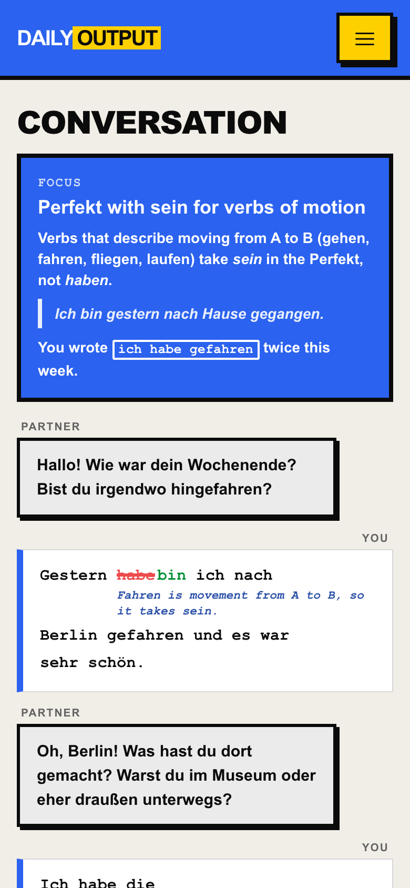
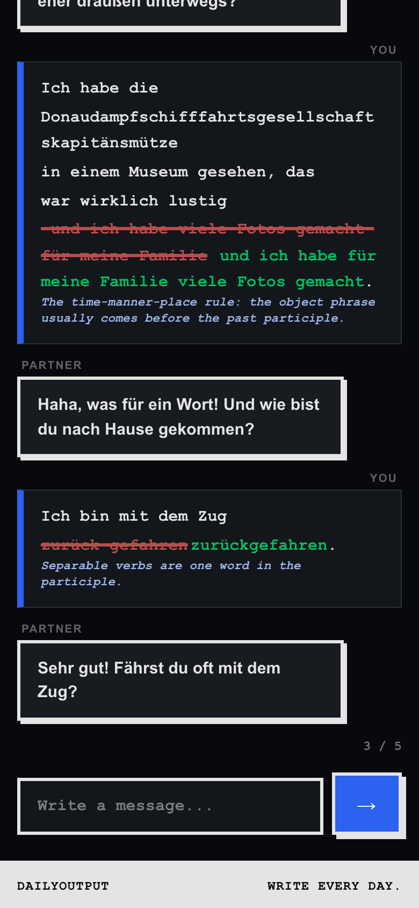
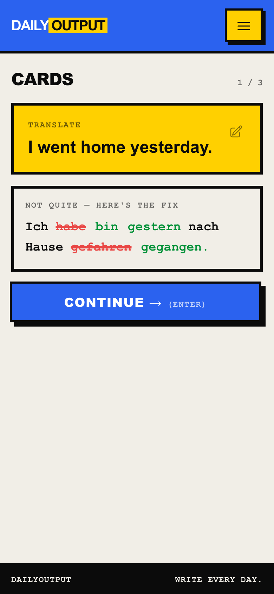
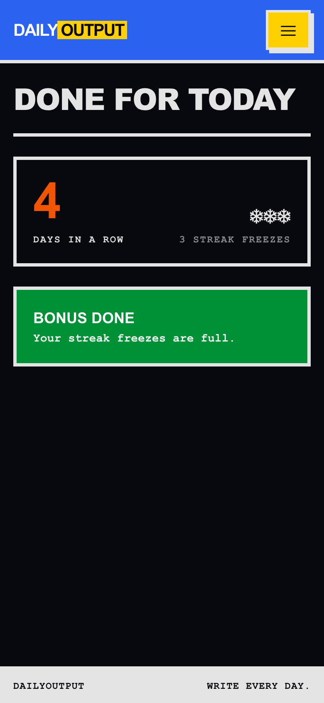

# DailyOutput

**Open the app and it tells you what to do. Write or talk in your target language, get corrected, then drill your own mistakes as flashcards.**

A self-hosted, single-user language-practice app built with Phoenix LiveView and SQLite. AI runs through [ReqLLM](https://hex.pm/packages/req_llm): **GPT-6.1 Sol by default, or GPT-6 Luna**, direct or via OpenRouter. Installable as a PWA. Brutalist UI, no external design system.

## Why

The only way to get better at a language is to produce output, writing and speaking, every day. DailyOutput takes every decision off your plate: open it and it tells you what to do. Feedback is calibrated to your CEFR level, so you only see mistakes you should know at that level, and your mistakes come back as flashcards.

## Your day

1. **One activity, picked for you.** Usually a conversation with an AI partner; about one day in three, a journal. A conversation ends after your 5th message; a journal's Finish button shows up after 5 minutes of writing.
2. **A focus.** A grammar point picked from your own recent mistakes, shown as a banner while you write and graded at the end.
3. **Corrections.** A clean rewrite with word-level strikethrough and inserts plus a short note on each change. It catches unnatural phrasing, not just outright errors.
4. **Cards.** Up to 20 flashcards made from your mistakes, with SM-2 spaced repetition and progressive fill-in-the-blank. Skipped when nothing is due.
5. **Done.** That passes the day and grows your streak. The bonus round does the other activity too and banks a streak freeze (up to 3), which covers a day you miss.

Reopening the app always picks up the exact step you're on.

## Features

- **The app decides** the activity, the topic, the focus, and the cards. No setup screens or choice lists.
- **History** of every finished conversation and journal, with its corrections.
- **Progress**: words written, corrections per 100 words over time, time spent, and your daily AI spend.
- **Daily reminders**: opt-in push notifications, managed per device.
- **Two models**: GPT-6.1 Sol (default) or GPT-6 Luna (much cheaper), through OpenAI's API or OpenRouter.
- **Installable PWA**: add it to your home screen. English or German UI, which switches to your target language at B1+.

## Screenshots

| | |
|---|---|
|  |  |
|  |  |

## Quick start

Run the published image with Docker Compose:

```yaml
# compose.yaml
services:
  daily_output:
    image: ghcr.io/szanzibar/daily-output:latest
    ports:
      - "${PORT:-4000}:4000"
    environment:
      # The AI key for the provider you pick in Settings. Default is OpenAI's own API:
      OPENAI_API_KEY: "sk-your-key"
      # ...or use OPENROUTER_API_KEY instead.
      # Public hostname your reverse proxy serves (used for HTTPS origin checks):
      PHX_HOST: "example.com"
    volumes:
      - ./data:/app/data
    restart: unless-stopped
```

```bash
docker compose up -d
```

That's it. On first boot the container generates its `SECRET_KEY_BASE`, creates the SQLite database, and runs migrations — everything persists in `./data`. Web Push keys are generated automatically too; there's nothing else to configure.

**Behind a reverse proxy (production):** DailyOutput serves plain HTTP on container port `4000` and expects HTTPS origin checks for `PHX_HOST`. Terminate TLS at your proxy and forward to the published `PORT`, which maps to container `:4000`.

## Configuration

The only thing DailyOutput needs is **one AI key**, matching the provider you choose in Settings:

| Provider | Key |
|---|---|
| Native API *(default)* | `OPENAI_API_KEY` |
| OpenRouter | `OPENROUTER_API_KEY` |

`ANTHROPIC_API_KEY` is optional. It's only used if you point a model at Anthropic, like `mix run scripts/bench.exs anthropic:claude-sonnet-5-5`.

Everything else is set on the in-app **Settings** page:

| Setting | Description |
|---|---|
| AI model & provider | GPT-6.1 Sol or GPT-6 Luna; native API or OpenRouter |
| Target / native language | The language you're learning and your first language |
| CEFR level | A1–C2 — calibrates feedback difficulty and the UI-language switch |
| About you | What you like to talk about and your goals; openers and prompts draw on it |
| Daily reminder | Per-device push notifications at a chosen time |
| UI language & appearance | Auto/English/German; light, dark, or follow OS |

## Languages

DailyOutput works with **any target language** for AI feedback. Two have tuned conventions:

- **German** — written as Swiss Standard German (`ss`, never `ß`).
- **Japanese** — written in rōmaji (Hepburn), never kana or kanji.

The **UI** is available in English (default) and German, and auto-switches to your target language once you reach B1+.

## Local development

Requires Elixir `~> 1.15` (with Erlang/OTP) and Node.js (for the JS test suite).

```bash
mix setup                # deps, DB, assets
cp .env.example .env      # add an AI key — OPENAI_API_KEY by default
mix phx.server            # http://localhost:4000
```

Run the checks before pushing:

```bash
mix test        # colocated with source under lib/
mix precommit   # compile (warnings as errors), format, full test suite
```

Before changing a prompt or the default model, run the benchmark. It sends fixed fixtures through every AI purpose and writes `tmp/bench/<model>-<effort>.json` with outputs, latency, tokens, and cost:

```bash
mix run scripts/bench.exs openai:gpt-6.1-sol
```

### Architecture

- **Phoenix LiveView** — every page is a stateful LiveView; no REST API.
- **Ecto + SQLite** — a single file-based database, no Postgres.
- **ReqLLM** — one client across providers (OpenAI, OpenRouter, Anthropic).
- **Tailwind v4** — a custom brutalist theme; JS is limited to DOM measurement, textarea auto-expand, and time tracking.
- **Gettext** — English source strings, German translations.

| Context | Purpose |
|---|---|
| `Today` | The daily flow: what to do next, the bonus, and the streak. Pages ask it and render the answer |
| `Planner` / `Focus` / `Streak` | Pure pickers and the streak walk, seeded by the date |
| `Activities` | Conversations and journals, one table for both |
| `AI` | One client for every call: openers, partner replies, proofreading, focus banners, flashcards |
| `Flashcards` | Spaced-repetition cards built from corrections |
| `Stats` | Progress aggregation (words, corrections, time, spend) |
| `Settings` | Single-row user configuration |
| `Push` / `Reminders` | Web Push subscriptions and the daily nudge |
| `Clock` | Timezone + 4am logical-day boundary — the source of truth for day math |

## Contributing

Contributions welcome. Areas that could use help:

- Additional UI translations (add a locale under `priv/gettext/`)
- Tuned conventions for more target languages (`DailyOutput.AI.LanguageProfile`)
- Accessibility and mobile-UX refinements

## License

MIT — see [LICENSE](LICENSE).
